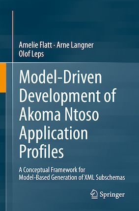

Good news, everybody: Our book 'Model-Driven Development of Akoma Ntoso Application Profiles' has been released! The book is a collaboration with my friends and former colleagues Amelie Flatt and Olof Leps. In it we outline a methodological framework for the use of model-driven development approaches to creating subschemas of the international Akoma Ntoso XML vocabulary for legislative documents.

## What is it about?

The book aims to serve as a practical and technical guide to teams that want to customize the international [Akoma Ntoso](http://www.akomantoso.org/) standard for a more narrowly defined use-case. Akoma Ntoso is a highly flexibly XML vocabulary geared towards machine-readable representation of legislative documents from a huge variety of legal traditions. While it provides a number of customization mechanisms, enforcing restrictions at multiple levels requires more complex mechanisms, such as creating subschemas. In the book, we describe a model-driven approach to developing a subschema. This consists of reducing complexity by capturing requirements in a suitable model and then building generators to programmatically create all needed artifacts, such as XML schemas, documentation and so forth, from the single source of truth that is the model. We go on to evaluate multiple different kinds of model, generation technologies and reflect on the suitability and potential of this approach.

## Where can I get it?

The book is published by Springer-Verlag, a well-known publishing house specializing in scientific and technical literature. The book is available both directly [from Springer-Verlag](https://link.springer.com/book/10.1007/978-3-031-14132-4) and [from Amazon](https://amzn.eu/d/iBVcpQk).

