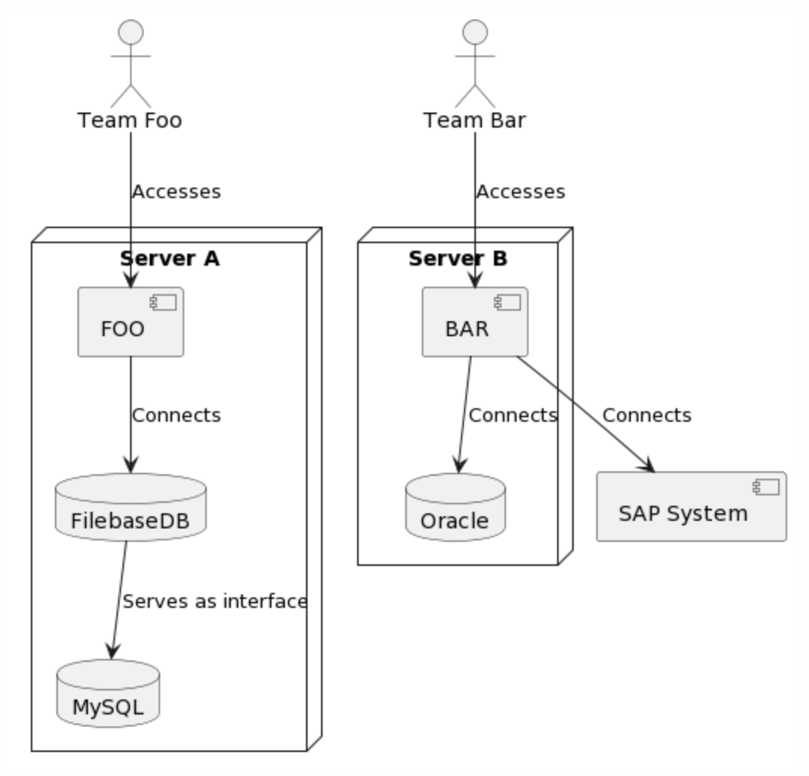

---
author:
  name: "Arne Langner"
date: 2022-12-27
linktitle: ChatGPT 1 - Visualizing System Architecture using PlantUML
type:
- post
- posts
title: ChatGPT 1 - Visualizing System Architecture using PlantUML
---


In this post we'll have a look at ways to generate visualizations using the openAI's ChatGPT, and diagrams-as-code.

ChatGPT does a great job at combining, summarizing and cross-referencing text. In many use-cases I would prefer to get some kind of visual overview though, either for my own comprehension or in order to present this information to others. The current UI of ChatGPT does not provide any other output than text though. As it turns out, this is not much of a dealbreaker, as ChatGPT is capable of producing both structured data and code. Combine this with one of the many diagram-as-code tools that use a domain-specific language to define the diagram content and layout and you have at your disposal the tools needed to generate all kinds of visualizations using ChatGPT.

In this post, we will describe a (very basic) system architecture in text and use ChatGPT to generate a visualization.


## Tools
**Note:** In the examples shown here, I will be using the [openAI playground](https://beta.openai.com/playground). It offers the same davinci-003 model that also powers the regular ChatGPT service but allows for cleaner output, more tuning options, and - seemingly - fewer throttling of requests.

[PlantUML](https://plantuml.com/en/) is a diagram-as-code tool that generates various UML diagrams from specifically structured text. It supports suitable diagrams for many static and dynamic contexts. A [free web renderer](http://www.plantuml.com/plantuml) is available which I will be using for this example.


### The Chat

First, I describe a simple system architecture consisting of two servers running two applications with some minor additions:

> Client ACME operates two servers in their data center.  Server A runs Windows Server 2008. It hosts the CRM application FOO that connects to a FilebaseDB, which serves as an interface to a MySQL database. All of these components run on the same server.  Users from Team Foo connect to this server via a local client. Server B runs CentOS. It hosts logistics application BAR. BAR connects to a Oracle database on the same server, and also to an external SAP system. Users from Team Bar log into the BAR application via a web interface.
> 
> Extract all named entities as bullet points. Describe each entity in one sentence, focusing on their location and connections to other entities.

This yields the following summary:

```python
• Server A: Windows Server 2008 running the CRM application FOO, which is connected to a FilebaseDB and a MySQL database, and accessed locally by users from Team Foo.
• Server B: CentOS hosting the logistics application BAR, which is connected to an Oracle database and an external SAP system, and accessed through a web interface by users from Team Bar.
• FilebaseDB: Database interface for MySQL database, located on Server A.
• MySQL database: Database connected to FilebaseDB on Server A.
• Oracle database: Database located on Server B, connected to logistics application BAR.
• SAP system: External system connected to logistics application BAR on Server B.
• Team Foo: Users who access Server A locally.
• Team Bar: Users who access Server B through a web interface.
```

I then requested this summary to be represented in plantUML notation. Initally, I began this with the following prompt:

> Represent this information as a deployment diagram in plantUML notation. Render entities as components. Nest components according to their location. Draw edges for relationships and label edges according to the description above.

This did inded begin to create code that looked like plantUML syntax, but needed a multitude of additional prompts to refine, fix and iron out syntax errors. You can see this odyssey in this [complete chat protocol](/files/chatgpt_deployment_diagram.txt)), note that I tend to prefix my own inputs with a ">" for clarity. ChatGPT does not seem to mind.

Lesson learned, I started over with a much more precise prompt:

> Represent this information as a deployment diagram in plantUML notation. Render servers as nodes, databases as databases, user teams as actors, applications as components. Nest elements according to their location. Draw edges for relationships between applications, databases and users, not for servers. label edges according to the description above.

As you can tell, I gave much more specifc instructions on how to use the plantUML syntax and how to represent the architectural components I described in the beginning. This yielded plantUML code that looked much more sane:

```python
@startuml
actor Team Foo
actor Team Bar
node "Server A" {
    component FOO
    database FilebaseDB
    database MySQL
}
node "Server B" {
    component BAR
    database Oracle
    SAP System
}
Team Foo --> FOO : Accesses
FOO --> FilebaseDB : Connects
FilebaseDB --> MySQL : Serves as interface
Team Bar --> BAR : Accesses
BAR --> Oracle : Connects
BAR --> SAP System : Connects
@enduml
```

Much better, but syntactically invalid - missing quotes, once again, and some confusion regarding locations. Luckily, this was easily fixed with one more instruction:

> Put team names in quotes. SAP System should be in qoutes, and drawn as a component outside of Server B.

This finally produced solid-looking plantUML code:

```python
@startuml
actor "Team Foo"
actor "Team Bar"
node "Server A" {
    component FOO
    database FilebaseDB
    database MySQL
}
node "Server B" {
    component BAR
    database Oracle
}
component "SAP System"
"Team Foo" --> FOO : Accesses
FOO --> FilebaseDB : Connects
FilebaseDB --> MySQL : Serves as interface
"Team Bar" --> BAR : Accesses
BAR --> Oracle : Connects
BAR --> "SAP System" : Connects
@enduml
```

Rendered in the online renderer, this code produces this magnificent diagram:




Ignoring both the somewhat nonsensical nature of the system described and my questionable use of UML semantics, this feels like a success!

### Findings

* It won't go right on the first attempt (see [complete chat protocol](/files/chatgpt_deployment_diagram.txt)) - that's okay, refine with additional prompts.
* Condensing instructions from multiple prompts into a single, more specific prompt will streamline future work much simpler.
* Knowing the right nomenclature really, really simplifies the process. PlantUML supports all 14 UML diagram types, and being able to tell ChatGPT which elements (actor, component, node, etc.) to use really makes it much easier to give precise instructions.  I would strongly suggest looking up the corresponding metamodel (ie. for the [deployment diagram](https://plantuml.com/en/deployment-diagram)) to get a better feeling for what you should request in your prompts.
* ChatGPT frequently produces syntax errors, usually minor ones though, such as not quoting strings that contain spaces.

### Conclusion

Clearly using diagram-as-code tools works to generate visualizations, though it may require a bit of experimentation. Based on the success of this experiment I'll add a few more articles on other kinds of visualizations, such as graphviz and mermaid.js.

