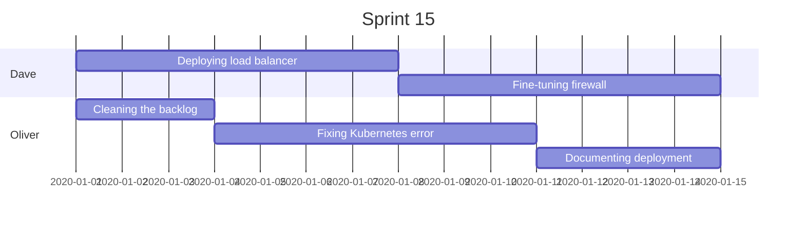
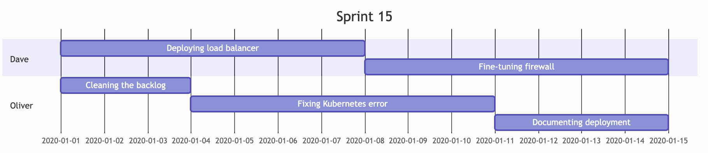
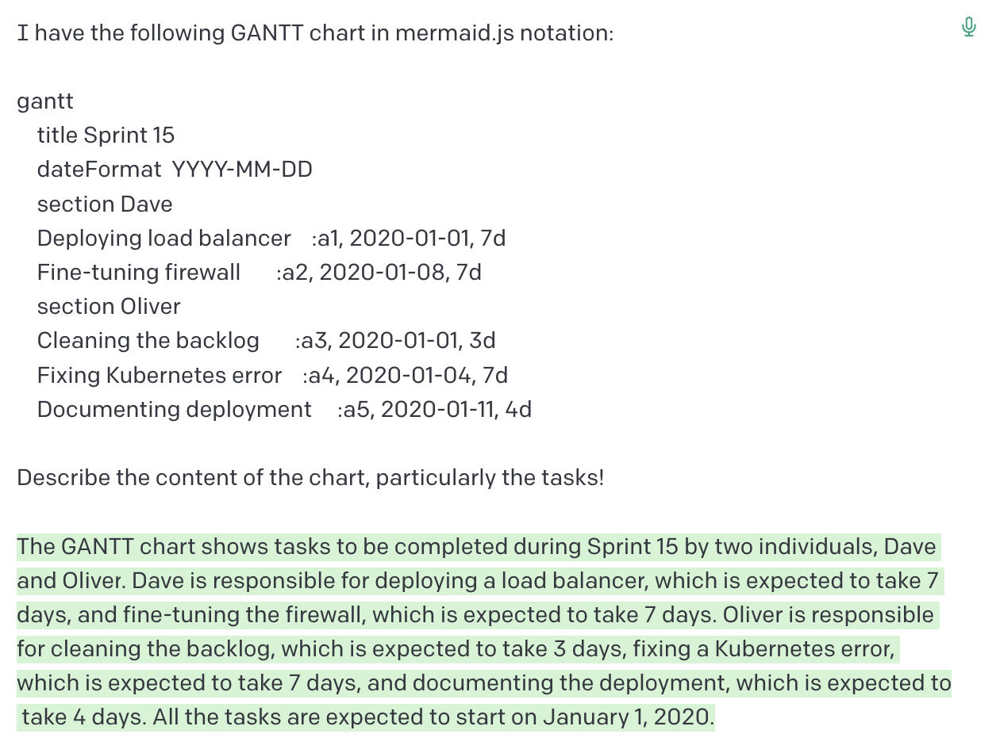

---
author:
  name: "Arne Langner"
date: 2022-12-28
linktitle: ChatGPT 2 - Visualizing Project Timelines with mermaid.js
type:
- post
- posts
title: ChatGPT 2 - Visualizing Project Timelines with mermaid.js
weight: 10
series:
- GPT
---

**This is the second post on visualizations using ChatGPT - see the [first article here](https://arne-langner.github.io/posts/2022/12/chatgpt-1-visualizing-system-architecture-using-plantuml/).** 

In this post we'll have another look at ways to generate visualizations using the openAI's ChatGPT, and diagrams-as-code. This time we will focus on turning a verbal description of a work plan into a GANTT chart.


## Tools
**Note:** In the examples shown here, I will be using the [openAI playground](https://beta.openai.com/playground). It offers the same davinci-003 model that also powers the regular ChatGPT service but allows for cleaner output, more tuning options, and - seemingly - fewer throttling of requests.

[mermaid.js](https://mermaid.js.org/intro/) is another diagram-as-code framework that integrates well with a number of developer-centric tools, particularly many implementations of markdown, such as the one used in GitHub or GitLab. In keeping with this focus, mermaid.js supports a number of diagram types commonly used by developers, such as state, flow and sequence charts, git branch diagrams and entity-relation diagrams. It, too, comes with an [online editor](https://mermaid.live/) to validate and render diagrams.


### The Chat

As before, I began by priming ChatGPT with a description of the work the team was planning to do:

> Our project team plans sprint no. 15, which lasts from January 1st to January 15. Dave will spend the first week on deploying a load balancer, the second week on fine-tuning the firewall. Oliver will spend three days on cleaning the backlog, then one week on fixing a Kubernetes error and the remaining time on documenting the deployment.
> 
> Present this information as a mermaid.js GANTT chart.

From the start, this produced syntactically valid mermaid diagrams. However, it required a bit of tweaking in order to generate a diagram that fulfilled my (woefully implicit) requirements: I ended up specifying the grouping of tasks and also some formatting options:

> Present this information as a mermaid.js GANTT chart. Create separate sections for each team member. Show task names in the diagram.

Eventually, this prompted the following output:

```python


It should be noted, that ChatGPT has obviously been trained on many a Markdown-based integration of mermaid.js. How can I tell? As you see, ChatGPT's output already includes the characteristic three backticks with the 'mermaid' annotation needed to have the mermaid.js code rendered directly in the Markdown document. This bit is not itself part of the mermaid.js notation. Based on its training data, ChatGPT presumes that mermaid.js code will most likely be used inside a Markdown document anyway.

Rendered, this will produce the following GANTT chart:



While the layout and styling could do with some more fine-tuning (looking at you, axis labels!) the overall result is farly promising!


### Findings

* Same as with plantUML, the specificity and clarity of both the initial data and the prompt are absolutely essential. Looking at the terms and concepts of the diagram types will go a long way with creating good prompts.
* In some ways, mermaid.js felt more erratic in terms of how minor changes to the prompts would change the produced code. For example, setting a year in the initial data would randomly cause ChatGPT to change the syntax of the individual tasks in the diagram, for example parallelize what should be sequential. I'm unsure what exactly caused this relative fragility, as my first guess would have been a smaller amount of training data when compared to plantUML - on second thought I'm not sure if that's true though, as I'm not aware of their relative popularity.

### Conclusion

As this article clearly shows, ChatGPT can be used to create GANTT chart overviews of textual work plans.

### PS: It works the other way around, too!

As I wrote the weighty conclusion above, I began wondering if in the context of work plans, the direction text -> diagram was a sensible one. Wasn't it more likely that someone would ask for an explanation of an existing diagram instead? Of course I decided to try this out!



Look and behold, ChatGPT would deliver a very concise summary of the work represented in this GANTT chart! This goes to show how much more versatile and useful diagrams generated from text are when compared to image formats.